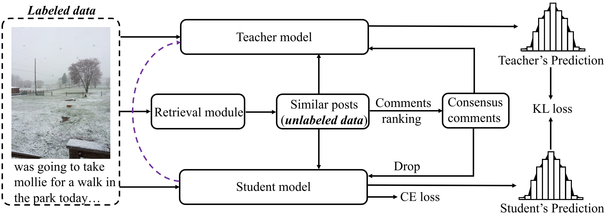

# Multimodal self-training  
PyTorch Code for the following paper at EMNLP2022:  
**Title**: Borrowing Human Senses: Comment-Aware Self-Training for
Social Media Multimodal Classification  
**Authors**: Chunpu Xu, Jing Li\
**Institute**: PolyU\
**Abstract**  
Social media is daily creating massive multimedia content with paired image and text, 
presenting the pressing need to automate the vision and language understanding for various 
multimodal classification tasks. Compared to the commonly researched visual-lingual data, 
social media posts tend to exhibit more implicit image-text relations.
To better glue the cross-modal semantics therein, we capture hinting features from user comments, 
which are retrieved via jointly leveraging visual and lingual similarity.
Afterwards, the classification tasks are explored via self-training in a teacher-student framework,
motivated by the usually limited labeled data scales in existing benchmarks.  
Substantial experiments are conducted on four multimodal social media benchmarks for image-text 
relation classification, sarcasm detection, sentiment classification, and hate speech detection.
The results show that our method further advances the performance of previous state-of-the-art models, 
which do not employ comment modeling or self-training.


**Framework illustration**\


**Dataset**\
In compliance with Twitter policy, the dataset (i.e., 27M cross-media tweets with comments) is available for non-commercial research only (https://developer.twitter.com/en/developer-terms/policy) and cannot be used for any discriminatory purpose, event monitoring, profiling or targeting of individuals.

The dataset, in the form of tweet IDs, can be obtained upon request to the authors by filling the following form: https://docs.google.com/forms/d/1vx6V3MTHr2p0zbGlU8-k66KnAPWr3d237xAXpfXyQPw.

## Retrieval
For the details of retrieval, please see the   `readme.md` in `./retrieval_code`.

## Data
### ITR task
Fot the ITR task, you could find the training file which contains tweet text and annotated label from `scripts/split_data/train_file.json`. 
The retrieved comments and similar tweet texts is stored in `retrieval_results_text_comment_top20.json`. 
For raw tweet image data of the ITR dataset (labeled data), please find it from [here](https://connectpolyu-my.sharepoint.com/:u:/g/personal/21038672r_connect_polyu_hk/EbK0jcZ7bkRJrOURLgL8cj8BioN6G84fN1f1qrX0tgaQ-Q?e=9BgUhQ). 
For raw images of retrieved similar tweets (unlabeled data), please find it from [here](https://connectpolyu-my.sharepoint.com/:u:/g/personal/21038672r_connect_polyu_hk/Eaud2hCia5pMklF-Q4TWKqUBaw9t3o_MymLlCmRcJdXGBg?e=J7XDrU)
Then, extract the image features of both labeled data and unlabeled data by the following command:
```
cd ITR_task/extract_img_features
python extract_img_feature.py
```
We also provide the extracted image features of labeled data [link](https://connectpolyu-my.sharepoint.com/:u:/g/personal/21038672r_connect_polyu_hk/ET0d8FwFzehMmmAUEjXWD2MBEmu4sXwHwZGkSt0I7F4hPQ?e=KNTNhv) and unlabeled data [link](https://connectpolyu-my.sharepoint.com/:u:/g/personal/21038672r_connect_polyu_hk/Edkpl8rtWXZNlURF1rOvzK4BrQ1EzLDfGMSyI6VBqYmnLA?e=fNvAPn). You can download the files and unzip them to `ITR_task`.

### MSD task
Fot the MSD task, you can download the data which contains training text data, validation text data, test text data, attributes and retrieval results from [here](https://connectpolyu-my.sharepoint.com/:f:/r/personal/21038672r_connect_polyu_hk/Documents/accepted_paper_data/EMNLP_self_training/multimodal_sarcasm/data?csf=1&web=1&e=AOBKH8) and put the data under `MSD_task`. 
For raw tweet image data of the MSD dataset (labeled data), please find it from [here](https://connectpolyu-my.sharepoint.com/:u:/r/personal/21038672r_connect_polyu_hk/Documents/accepted_paper_data/EMNLP_self_training/multimodal_sarcasm/MSD_dataset.zip?csf=1&web=1&e=gJclGV). 
For raw images of retrieved similar tweets (unlabeled data), please find it from [here](https://connectpolyu-my.sharepoint.com/:u:/g/personal/21038672r_connect_polyu_hk/ERSEEiZJ9fJKumVP5FK_Ly0BJOpvF5035j8qxf67MnUB5Q?e=cFkZ8f).
Then, extract the image features of both labeled data and unlabeled data by the following command:
```
cd MSD_task/extract_img_features
python extract_img_feature.py
```

You can download the extracted image features of labeled data [link](https://connectpolyu-my.sharepoint.com/:u:/g/personal/21038672r_connect_polyu_hk/Ed_DrZGhR8lOmhAMax2lX1QBx0KaJP2EQd2RE8NJWykMEQ?e=MLMbPt) and unlabeled data [link](https://connectpolyu-my.sharepoint.com/:u:/g/personal/21038672r_connect_polyu_hk/EZqeF0jCiHVMmvycsp4RhswBR1dTZOXuI4UIEvS6scqFMg?e=JkzzH1). Then unzip them to `MSD_task`.


TODO: For the the code and data for other tasks will be released soon.
## Installation
```
# Create environment
conda create -n multimodal_ST  python==3.6
# Install pytorch 
conda install -n multimodal_ST  -c pytorch pytorch==1.10.0 torchvision
```

## Training
### ITR task
```
cd ITR_task
python run_rel.py --img_feature_path ./img_features --self_img_feature_path ./self_img_features_3
```
We provide our pretrained models of ITR task in [here](https://connectpolyu-my.sharepoint.com/:u:/g/personal/21038672r_connect_polyu_hk/ERzpdx2oPPtBtBRDzc3Dqk0BK3ZuBeW_QtS8BabwGvkKgg?e=nYDglq).

### MSD task
```
cd MSD_task
python run_sarcasm.py --img_feature_path ./img_features --self_img_feature_path ./self_img_features_3
```
We provide our pretrained models of MSD task in [here](https://connectpolyu-my.sharepoint.com/:u:/g/personal/21038672r_connect_polyu_hk/ETfXNYkm55RNtKHQQEAtNpUBYwkLyY5Fjx6jODUUBOG5ag?e=AqnANi).

# License
This project is licensed under the terms of the MIT license. 
